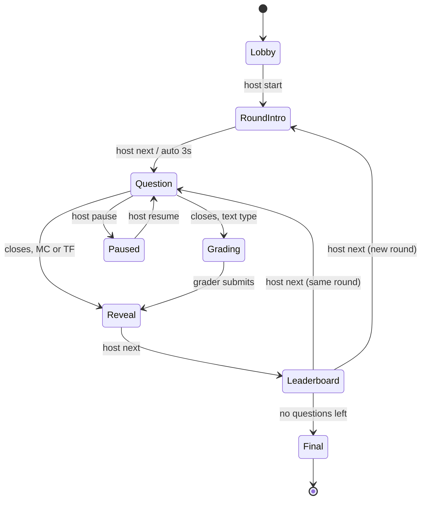
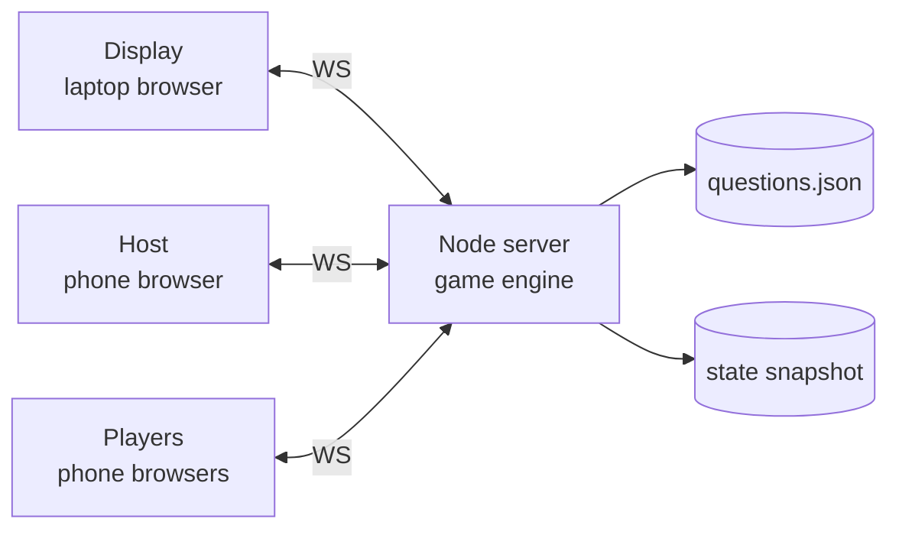

# Party Trivia App — Requirements & Design

Sep 21, 2026 · @Arjun

## Overview & goals

A Kahoot-style party game: one shared screen shows questions, guests answer on their phones in a browser, and a live leaderboard runs between rounds. Questions can be multiple choice, true/false, short answer, or free response; the first two are auto-graded, and the text types are marked by a human on a phone between the question and the reveal. Target is a single evening, roughly 10–40 players, built and tested by one developer in about a weekend.

**Success criteria**

- A guest goes from scanning a QR code to answering the first question in under 30 seconds, with no app install or account.
- Zero lost answers or crashes over a 45–60 minute game.
- The host can pause, skip, or fix a score without touching a terminal.

**Non-goals**

- Multi-tenant hosting, user accounts, or persistent history beyond the party.
- A question-authoring UI (questions live in a JSON file), and automated grading of free text; a human reads those.
- Anti-cheat beyond basic server-side timing; this is a friendly party.

## Users & roles

Three clients connect to one server; each is a route in the same web app.

| Role | Device | Route | Can do |
| --- | --- | --- | --- |
| Display | Laptop on projector/TV | `/display` | Show lobby QR, questions, countdown, answer reveal, leaderboard. Read-only. |
| Host | Host's phone (or same laptop) | `/host?key=…` | Start game, advance, pause, skip, kick player, adjust score. |
| Grader | A friend's phone or tablet | `/grade?key=…` | Mark free-text answers correct, partial, or wrong. May be the host on the same device. |
| Player | Guest phone | `/play` (via QR) | Join with a nickname, answer, see own result and rank. |

The host and grader routes are protected by secret keys in the URL, set via environment variables. Separating host from display lets the birthday person run the game from their phone while walking around. Grading is a separate route so it can be handed to a friend, letting the host keep the room's attention while answers are marked; one person can open both.

## Functional requirements

Keywords follow RFC 2119: MUST is the party-day minimum; SHOULD and MAY are cut first if time runs short.

| ID | Requirement | Priority |
| --- | --- | --- |
| FR-1 | Load questions from a `questions.json` file at startup, validated against a schema; reject the file with a clear error on invalid input. | MUST |
| FR-2 | Display shows a lobby with a QR code and short URL, plus a live list of joined nicknames. | MUST |
| FR-3 | Players join with a nickname (1–16 chars, unique, profanity-light filter optional). | MUST |
| FR-4 | Support four question types: multiple choice (2–6 options), true/false, short answer (one line, \~40 chars), and free response (multi-line, \~300 chars). Each has a time limit, default 20 s for MC/TF and 45 s for text. | MUST |
| FR-5 | MC and TF are auto-graded server-side against the answer key. | MUST |
| FR-6 | Short and free-response answers are graded manually by a human at a `/grade` route; MAY be assisted by auto-matching (FR-19). | MUST |
| FR-7 | Phone input adapts to type: large shape-coded buttons for MC/TF, a single text field for short answer, a textarea with character counter for free response. One submission per player per question, locked on send. | MUST |
| FR-8 | Display shows live count of answers received and a countdown. | MUST |
| FR-9 | Question closes when the timer expires or all connected players have answered. | MUST |
| FR-10 | For text questions, the game enters a Grading phase after the question closes. The grader sees all answers anonymized by default and marks each correct, partial, or wrong; the display shows a neutral grading screen. | MUST |
| FR-11 | Grader can mark identical normalized answers in bulk (one tap grades every player who typed the same thing). | MUST |
| FR-12 | Reveal shows the correct answer plus, by type: answer distribution for MC/TF, or a selection of player answers for text. Each phone shows its own result and points. | MUST |
| FR-13 | Leaderboard (top 10) shown after each question or round, final podium at the end. | MUST |
| FR-14 | Host controls: start, next, pause/resume, skip question, end game. | MUST |
| FR-15 | Players who refresh or lose signal rejoin with the same identity and score. | MUST |
| FR-16 | Game state, including grading in progress, survives a server restart (snapshot to disk). | SHOULD |
| FR-17 | Rounds/categories with a title card between them. | SHOULD |
| FR-18 | Image on question (served from a local `/media` folder). | SHOULD |
| FR-19 | Auto-match short answers against an `acceptable` list in the question file (case-insensitive, trimmed, punctuation-stripped); pre-mark matches as correct so the grader only reviews the rest. | SHOULD |
| FR-20 | Host can kick a player and manually adjust a score, including regrading an answer after reveal. | SHOULD |
| FR-21 | Grader can highlight a free-response answer to show on the projector during reveal, with the author's nickname, for the funny ones. | SHOULD |
| FR-22 | Numeric closest-wins questions (e.g. what year was I born), auto-scored by distance. | MAY |
| FR-23 | Team mode (players pick a team; team score = mean of members). | MAY |
| FR-24 | Sound effects and background music on the display. | MAY |

## Non-functional requirements

| ID | Area | Requirement |
| --- | --- | --- |
| NFR-1 | Capacity | 50 concurrent players with headroom; design target is 40. |
| NFR-2 | Latency | Server-to-phone state change visible in under 500 ms p95 on typical 4G/Wi-Fi. |
| NFR-3 | Fairness | Answer timing measured on the server, not the client, so clock skew and slow phones don't change scores beyond network latency. |
| NFR-4 | Compatibility | Works in current mobile Safari and Chrome; no install, no login, no cookies beyond a local player token. |
| NFR-5 | Network | Must work if venue Wi-Fi is poor: phones reach the server over cellular (see Architecture). |
| NFR-6 | Readability | Display legible from \~8 m: question text at least 48 px on 1080p, high contrast. |
| NFR-7 | Accessibility | Answer options distinguished by shape and letter, not color alone. |
| NFR-8 | Privacy | Store only nicknames and scores; delete everything after the party. |

## Game flow & state machine

The server owns a single game state machine; every client renders purely from the current phase. Clients never advance the game themselves.



Transitions out of Question are the only timer-driven ones; everything else waits for the host or the grader, so the pace follows the room. Pausing stores the remaining time and restores it on resume. The route out of Question is decided by the question's type: auto-graded types skip straight to Reveal, while short and free-response questions stop in Grading until a human finishes marking. Grading itself is untimed, since rushing it produces disputes; the host can override and force Reveal, scoring any unmarked answer as wrong.

## Architecture

One Node.js process holds all game state in memory and pushes it to every client over WebSockets. No database: at this scale a JSON snapshot on disk is enough.



**Stack (recommended)**

- Server: TypeScript, Node 20+, Fastify (static files + health route) and Socket.IO for realtime. Socket.IO gives reconnection, rooms, and acks for free; raw `ws` is fine if you prefer fewer dependencies.
- Client: a single Vite + React (or Svelte) SPA with three routes. Shared TypeScript types for messages between client and server.
- Validation: Zod schemas for `questions.json` and every inbound message.

**Hosting options**

| Option | How phones connect | Pros | Cons |
| --- | --- | --- | --- |
| Cloud (Fly.io, Render, Railway) — recommended | Public HTTPS URL, Wi-Fi or cellular | Immune to bad venue Wi-Fi; real TLS | Needs internet at the venue for the display too; small cost |
| Laptop on local Wi-Fi | `http://192.168.x.x:3000` | No internet needed; zero cost | Guests must join the right Wi-Fi; client isolation on some routers blocks it |

Run a single instance only: state is in memory, so horizontal scaling would split the game. Keep one always-on machine (no scale-to-zero) during the party.

## Data model

Questions are authored as JSON; runtime state is one in-memory object, snapshotted to disk after every transition.

```typescript
// questions.json — a discriminated union on `type`
type BaseQuestion = {
  id: string;              // stable, e.g. "r1q3"
  prompt: string;
  image?: string;          // path under /media
  timeLimitSec?: number;
  points?: number;         // default 1000
};

type Question =
  | (BaseQuestion & { type: "mc"; options: string[]; correct: number })
  | (BaseQuestion & { type: "tf"; correct: boolean })
  | (BaseQuestion & {
      type: "short";
      answer: string;        // shown at reveal as the official answer
      acceptable?: string[]; // auto-match list (FR-19)
      allowPartial?: boolean;
    })
  | (BaseQuestion & {
      type: "free";
      answer?: string;       // optional rubric or model answer for the grader
      maxChars?: number;     // default 300
      allowPartial?: boolean;
    })
  | (BaseQuestion & { type: "numeric"; correct: number });

type QuestionFile = {
  title: string;
  defaultTimeLimitSec: { choice: number; text: number }; // 20 / 45
  rounds: { title: string; questions: Question[] }[];
};

// runtime
type Player = {
  id: string;          // server-issued UUID
  token: string;       // secret, stored in phone localStorage for rejoin
  nickname: string;
  score: number;
  streak: number;
  connected: boolean;
};

type Grade = "correct" | "partial" | "wrong" | "ungraded";

type Answer = {
  playerId: string;
  questionId: string;
  choice?: number | boolean;  // mc, tf, numeric
  text?: string;              // short, free — raw as typed
  normalized?: string;        // lowercased, trimmed, punctuation-stripped
  receivedAt: number;         // server ms timestamp
  grade: Grade;               // auto-set for mc/tf/numeric at close
  gradedBy?: "auto" | "human";
  points: number;             // 0 until graded
  featured?: boolean;         // FR-21: show on projector at reveal
};

type GameState = {
  phase: "lobby" | "roundIntro" | "question" | "paused" | "grading" | "reveal" | "leaderboard" | "final";
  roundIdx: number;
  questionIdx: number;
  questionOpenedAt?: number;
  remainingMsOnPause?: number;
  players: Record<string, Player>;
  answers: Answer[];
  version: number;     // increments on every change
};
```

The answer key never leaves the server until the Reveal phase, so it cannot be read from browser dev tools. Grading is stored per answer rather than as a separate pass, so a regrade after reveal (FR-20) is a single field update plus a score recompute. Scores are always derived by summing `points` across answers, never incremented in place, which keeps regrades and restarts safe.

## Realtime protocol

The server broadcasts full, role-filtered state snapshots rather than deltas; at under 50 players each snapshot is a few KB, and snapshots make reconnection trivial. Clients send only intents.

| Direction | Event | Payload | Notes |
| --- | --- | --- | --- |
| Player → Server | `join` | `{ nickname }` | Ack returns `{ playerId, token }` or an error (name taken, game started). |
| Player → Server | `rejoin` | `{ token }` | Restores identity and score. |
| Player → Server | `answer` | `{ questionId, choice }` or `{ questionId, text }` | Rejected if wrong phase, wrong question, already answered, or text over the length cap. Ack confirms lock-in. |
| Host → Server | `host:cmd` | `{ cmd: "start" \| "next" \| "pause" \| "resume" \| "skip" \| "end" \| "forceReveal" }` | Requires host key on the socket handshake. `forceReveal` ends grading early. |
| Host → Server | `host:adjust` | `{ playerId, delta }` or `{ kick: playerId }` | SHOULD tier. |
| Grader → Server | `grade:set` | `{ questionId, answerIds: string[], grade }` | Array so one tap can grade a bulk group (FR-11). Requires grader key. |
| Grader → Server | `grade:feature` | `{ answerId, featured }` | Marks an answer to show on the projector at reveal. |
| Grader → Server | `grade:submit` | `{ questionId }` | Advances to Reveal. Rejected while any answer is `ungraded` unless `{ force: true }`. |
| Server → Display | `state` | Phase, question (no answer key), countdown deadline, answer count, leaderboard, featured answers at reveal | Deadline sent as absolute server time plus a clock offset measured on connect. During Grading, sends only a neutral screen and a progress count. |
| Server → Player | `state` | Phase, own options or input mode, own submitted answer, own result and rank | Never includes other players' answers. During Grading, shows a waiting state. |
| Server → Host | `state` | Everything the display sees plus player list with connection status and grading progress |  |
| Server → Grader | `grade:queue` | `{ questionId, prompt, answerKey, groups: [{ normalized, count, answerIds, grade, suggested }] }` | Answers grouped by normalized text, largest group first. Nicknames omitted unless the grader toggles them on. |

Only the grader socket ever receives raw player text before reveal, which keeps answers off the projector until they have been read by a human.

Every `state` carries `version`; clients ignore any snapshot older than the last one rendered.

## Scoring

Scoring depends on whether the type is auto-graded. For MC and TF, a correct answer earns between 50% and 100% of the question's points, linearly by speed; a wrong or missing answer earns 0.

```latex
\text{points} = \left\lfloor P \cdot \left(1 - \frac{t}{2T}\right) \right\rceil
```

Here P is the question's points (default 1000), t is server receive time minus question open time, and T is the time limit. So an instant correct answer scores 1000 and a last-second one scores 500.

For short and free response, speed is not rewarded. Typing is slower and uneven across phones and thumbs, so a speed term would measure dexterity rather than knowledge. Instead, the grade sets the points directly:

| Grade | Points |
| --- | --- |
| Correct | P (full) |
| Partial | 0.5 × P, only when the question sets `allowPartial` |
| Wrong or blank | 0 |

Other rules:

- Speed matters on MC and TF, but knowledge matters more: a slow correct answer always beats a fast wrong one.
- Text questions MAY carry higher `points` than choice questions, since they cannot be guessed. A 1500-point free response is a reasonable default.
- Optional streak bonus: +100 per consecutive correct answer, capped at +500. Partial credit does not break a streak but does not extend it. Off by default.
- Numeric questions (MAY): closest answer gets P, others scale down by rank; ties split evenly.
- Leaderboard ties break by total response time on auto-graded questions only (lower wins).

## UI

The display carries the content; phones are deliberately minimal so guests look up at the screen, not down.

| Phase | Display (projector) | Player phone | Host / grader |
| --- | --- | --- | --- |
| Lobby | Big QR + short URL, joined nicknames popping in, player count | Nickname field, then a note to watch the screen | Player list, Start |
| Round intro | Round title card | Next round coming up | Next |
| Question (MC/TF) | Question text, image, options with shapes (▲ ◆ ● ■) and letters, countdown ring, 17 / 23 answered | Full-width shape-coded buttons; after tap: Locked in | Pause, Skip, live answer count |
| Question (short/free) | Question text, image, countdown ring, answered count, no answers shown | Text field or textarea with character counter and a Send button; after send: Sent, with the text shown back | Pause, Skip, live answer count |
| Grading | Neutral card: a title such as Judging in progress, plus an X of Y graded progress bar. No answer text. | Waiting state, own answer shown back | Grader queue (below) |
| Reveal | Correct answer; distribution bars for MC/TF, or 2–3 featured answers with nicknames for text | Green/amber/red result, points earned, current rank | Next |
| Leaderboard | Top 10 with rank movement arrows | Own rank and score | Next |
| Final | Podium for top 3, then full list | Final rank | End, Restart |

**Grader screen**

The grader is the bottleneck between every text question and the reveal, so this screen is designed for speed with one thumb:

- Answers grouped by normalized text, largest group first, with a count badge (`"paris" × 7`). One tap grades the whole group.
- Three fixed buttons per group: correct, partial (hidden when `allowPartial` is false), wrong. Swipe right/left as an alternative.
- The official answer pinned at the top; auto-matched groups (FR-19) arrive pre-marked correct and collapsed.
- Nicknames hidden by default with a toggle, so marking stays honest when the birthday person is grading their own friends.
- A star button on any answer features it on the projector at reveal.
- A Submit button showing how many remain ungraded; submitting with any left prompts once before scoring them wrong.

Phones should request a screen wake lock during the game so they do not sleep between questions. Keep phone text to a few words per phase.

## Edge cases & failure handling

| Situation | Handling |
| --- | --- |
| Phone locks, refreshes, or drops signal | Token in localStorage triggers `rejoin`; player resumes at current phase with score intact. Missed questions score 0. |
| Half-typed answer when the timer expires | Lost. The phone autosaves the draft locally and, if the question is still open on reconnect, restores it; there is no partial submit. Call this out on the display for the first text question. |
| Answer arrives after deadline | Server rejects it; a 300 ms grace window absorbs network jitter. |
| Double tap or duplicate send | First valid answer wins; later ones are ignored idempotently. |
| Grader disconnects mid-grading | Grades already set are on the server; reopening `/grade` restores the queue. The host can also force reveal. |
| Grader is slow and the room stalls | Host sees grading progress and can force reveal; ungraded answers score 0 and can be regraded later (FR-20). |
| Offensive or off-topic free-text answer | Nothing reaches the projector unless the grader stars it, so the default is safe. Host can kick the author. |
| Grading dispute after reveal | Host regrades the answer; scores recompute by summing points, so the leaderboard corrects itself. |
| Late joiner mid-game | Allowed; starts at 0 and joins at the next question. |
| Duplicate nickname | Rejected at join with a prompt to pick another. |
| Display laptop disconnects | Display is stateless; reopen `/display` and it renders the current phase. |
| Server crash or redeploy | Restart loads the last snapshot, including partial grading; clients auto-reconnect and rejoin. |
| Host phone dies | Host URL works from any device, including the display laptop. |
| All answered with disconnected players | Count only players connected at question open, so a sleeping phone does not hold up the room. |
| Typo or wrong answer key in a question | Host can skip the question or adjust scores (FR-20). |

## Build plan, testing & party-day checklist

The MUST tier is roughly 15–20 hours of work; build it end to end with one MC question first, then add the other types, then layer SHOULD items.

| Milestone | Scope | Estimate |
| --- | --- | --- |
| M1 Skeleton | Repo, shared types, Fastify + Socket.IO, three empty routes, question loader + Zod schema | 2 h |
| M2 Engine | State machine, timers, answer validation, per-type scoring, grading phase, unit tests | 4 h |
| M3 Clients | Lobby/QR, four question input modes, reveal, leaderboard, host controls, grader queue | 5 h |
| M4 Resilience | Rejoin via token, snapshot/restore, clock offset | 2 h |
| M5 Polish | Rounds, images, kick/adjust, styling for projector | 3 h |
| M6 Deploy + rehearse | Deploy, load test, dry run with friends | 2 h |

**Testing**

- Unit-test the engine as pure functions: `(state, event, now) → state`. Inject the clock so timer logic is deterministic.
- Load test: a script opening 60 Socket.IO clients that join and answer randomly; confirm p95 broadcast latency under 500 ms.
- Real-device test on at least one iPhone and one Android, including lock-screen and rejoin.

**Party day**

- [ ] Server deployed, always-on, health check green
- [ ] Final `questions.json` validated and answer keys double-checked
- [ ] Display laptop: HDMI tested, browser fullscreen, sleep disabled, audio routed
- [ ] Host URL bookmarked on phone and laptop
- [ ] Printed QR code as backup at the entrance
- [ ] One full dry-run game the day before

## Open questions

- [ ] Party date, and how many guests are expected?
- [ ] Does the venue have reliable internet for the display laptop (decides cloud vs local hosting)?
- [ ] Who grades? A friend on a second phone, or you on the host device?
- [ ] Roughly what mix of question types, since text questions roughly double the time per question?
- [ ] Should partial credit exist at all, or keep grading binary to move faster?
- [ ] Individual players or teams?
- [ ] Prizes, and should the host see answers before revealing them?
